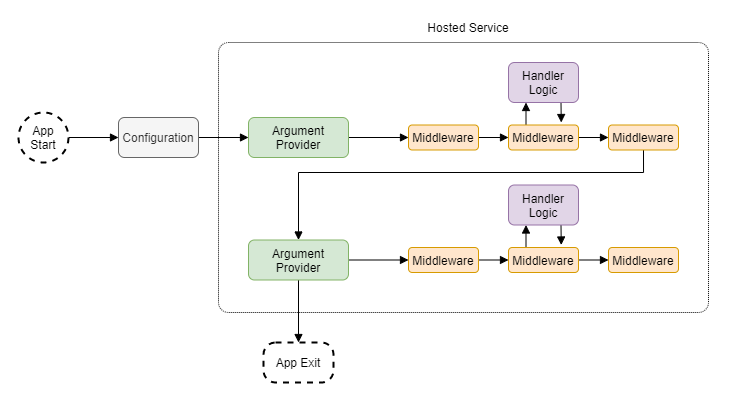

# Vertical ConsoleApps

A lightweight mini-framework for console applications with command support, dependency injection, and a processing pipeline.

## Overview

This library provides a base upon which to build feature-rich console applications using `IHostedService`, and provides an environment integrated with dependency injection and a configurable command pipeline.

### Features

1. Route control flow to different methods depending on command arguments.
2. Fully integrate services with dependency injection.
3. Use API style "controllers" to handle command arguments.
4. Validate, transform, or even short circuit a fully customizable argument pipeline.

### Design Overview

The framework is based around leveraging an [IHostedService](https://docs.microsoft.com/en-us/aspnet/core/fundamentals/host/hosted-services?view=aspnetcore-6.0&tabs=visual-studio#ihostedservice-interface) for the runtime environment of a console application. Configured providers _feed_ command arguments to a pipeline. A middleware pipeline validates, transforms, and provides the implementation logic for the commands. It mimics a request/response framework, where the request are command arguments and the response is console output.

The drawing below illustrates the flow of a typical application.



#### Input Providers

Input provides feed commands to the argument pipeline. Below are examples of input providers:

1. Static arguments: Arguments known at compile time, or program entry arguments
2. Script files: Arguments read and parsed from text files
3. Environment variables: Arguments parsed from environment variables
4. Interactive user input: Arguments read from console input

Input providers are evaluated in the order in which they are registered in configuration. For instance, you may have a complex application that handles the program's entry arguments, read setup from a script file, then accept user input.

#### Argument Pipeline

The argument pipeline is composed of one or more components that have access to the arguments received. The framework will invoke the component at the very top of the pipeline with the arguments and a delegate to the next component in the pipeline. The implementation can produce several different behaviors:

1. Perform its responsibility then forward control to the next component
2. Forward control to the next component then perform its responsibility
3. Perform its responsibility then short circuit the rest of the pipeline

#### Command Routing

Command routing involves treating arguments as commands that are customized with parameters. For instance, consider the following input:

```
$ mv ~/documents/file.txt ~/backup/file.txt
```

In this example, `mv` is the command while `~/documents.file.txt` and `~/backup.file.txt` are the parameters that control the command's behavior. If your application supports multiple logic branches, and control flow is determined by argument input, then it can leverage command routing.

Commands are routed by identifying in configuration the name of the command and transferring program control to a handler. Handlers come in several flavors:

1. Delegates that receive the arguments and a cancellation token.
2. A type that implements `ICommandHandler` and provides the implementation for a single command.
3. A type that acts like a controller that provide implementations for one or more commands.

## Usage

### Installation

Install the package into a console application.

```
$ dotnet add package vertical-consoleapps
```

### Skeleton Setup

The following example demonstrates an outline for console application setup:

```csharp
private static Task Main(string[] args)
{
    var hostBuilder = ConsoleHostBuilder
        .CreateDefault()
        .ConfigureServices(services => 
        {
            // * TODO * 
            // Provide registrations for services that are managed by
            // dependency injection. Note that for each set of arguments that
            // are processed by the framework, a new service provider scope is
            // created.
            
        })
        .ConfigureProviders(providers => 
        {
            // * TODO *
            // Providers feed values to the argument pipeline. They are
            // evaluated in the order in which they are registered with the
            // provided configuration object. Argument input can come from
            // environment variables, script files, program entry arguments (args),
            // interactively from the console, or from custom implementations of
            // IArgumentsProvider.
        })
        .Configure(app =>
        {
            // * TODO *
            // Compose a pipeline that receives the arguments from providers and processes
            // them. Components in the pipeline can catch errors, log, validate argument values,
            // transform/replace argument values, provide logic implementations, or route values
            // to handlers.
        });
        
    return hostBuilder.RunConsoleAsync();
}
```
